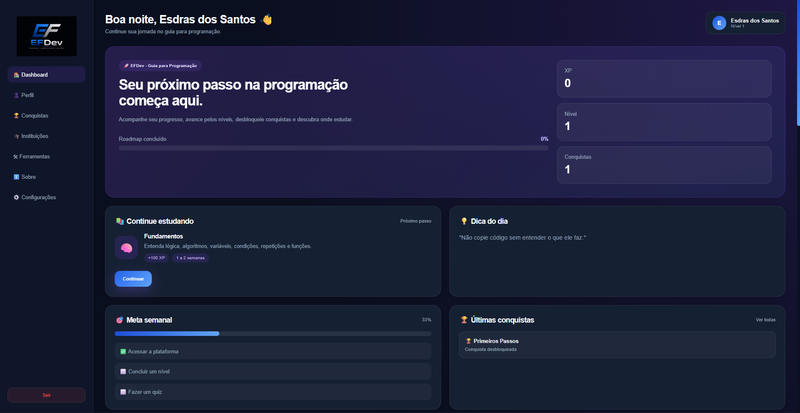
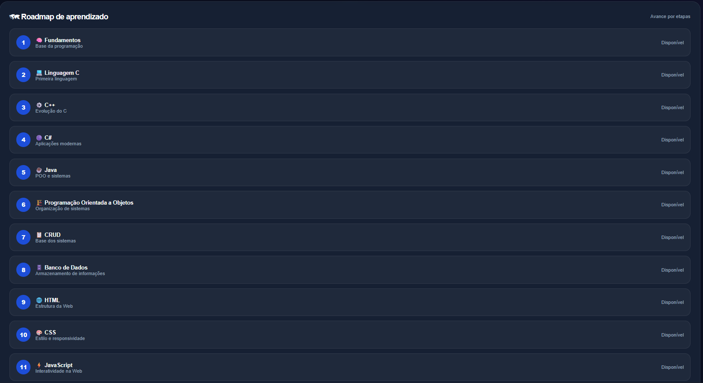

<div align="center">


# EFDev - Guia para Programação

### 🚀 Seu próximo passo na programação começa aqui.

Plataforma web desenvolvida para orientar iniciantes na programação através de roadmap, quizzes, XP, conquistas, instituições recomendadas e recursos úteis.

[🌐 Acessar Projeto](https://SEU-USUARIO.github.io/NOME-DO-REPOSITORIO/) • [📂 Repositório](https://github.com/SEU-USUARIO/NOME-DO-REPOSITORIO)


</div>

---

## 📖 Sobre o Projeto

A **EFDev - Guia para Programação** é uma plataforma criada para orientar pessoas que estão iniciando na área da programação.

A proposta não é substituir cursos ou professores, mas ajudar o usuário a descobrir:

- Por onde começar;
- Qual tecnologia estudar primeiro;
- Qual ordem seguir;
- Onde estudar;
- Quais ferramentas utilizar;
- Como acompanhar sua evolução.

---

## ✨ Funcionalidades

- 🔐 Login e Cadastro
- 📊 Dashboard Interativo
- 🗺 Roadmap de Estudos
- 📚 Introdução por nível
- 🧠 Quizzes por etapa
- 🏆 Sistema de Conquistas
- ⭐ Sistema de XP
- 🎓 Instituições Recomendadas
- 🛠 Ferramentas Recomendadas
- 👤 Perfil do Usuário
- 📚 Recursos Complementares
- 📱 Layout Responsivo

---

## 🖥️ Demonstração

### Login e Cadastro


### Dashboard



### Roadmap e Quizzes




---

## 🛣 Roadmap da Plataforma

```text
Fundamentos
↓
Linguagem C
↓
C++
↓
C#
↓
Java
↓
POO
↓
CRUD
↓
Banco de Dados
↓
HTML
↓
CSS
↓
JavaScript
